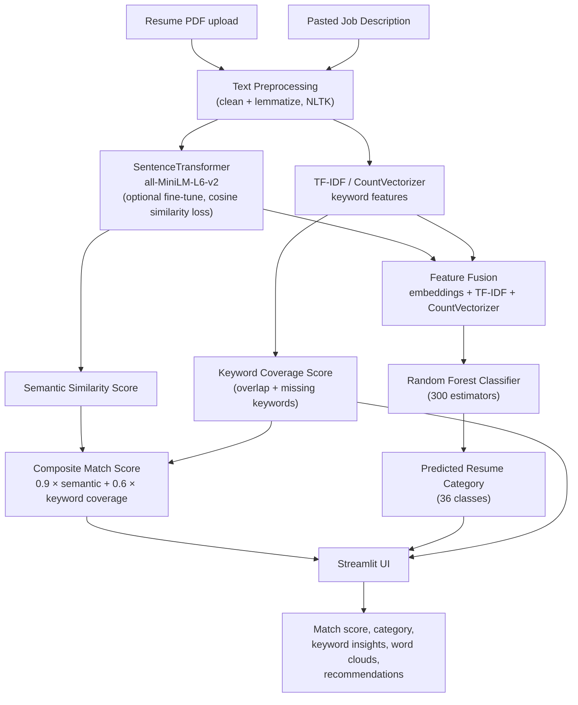

# Job-Resume-and-Description-Matching

AI-powered system to evaluate how well a resume aligns with a job description. Uses SentenceTransformers for semantic similarity, TF-IDF / CountVectorizer for keyword relevance, and a Random Forest classifier for resume category prediction. Built as a Streamlit app with interactive insights and visualizations.

---

## Architecture



**Flow summary:**
1. The user uploads a resume (PDF) and pastes a job description into the Streamlit app.
2. Both texts are cleaned and lemmatized (NLTK stopword removal + lemmatization).
3. The cleaned text is embedded with a fine-tuned `all-MiniLM-L6-v2` SentenceTransformer for semantic similarity, and separately vectorized with TF-IDF/CountVectorizer for keyword-level features.
4. Embeddings + TF-IDF + CountVectorizer features are fused and fed into a tuned Random Forest classifier to predict the resume's professional category.
5. Semantic similarity and keyword coverage are combined into a single composite match score, and the UI renders scores, category prediction, keyword overlap/gaps, and word clouds.

---

## Features

- **Resume Category Classification** — Predict professional domain.
- **Resume–JD Matching** — Semantic + keyword match score.
- **Keyword Insights** — Overlapping and missing JD keywords.
- **Explainable Scores** — Composite relevance scores with suggestions.

---

## Installation

```bash
pip install --upgrade pip
pip install -r requirements.txt
```

`requirements.txt`:
```
streamlit
torch
sentence-transformers
scikit-learn
nltk
PyPDF2
joblib
scipy
pandas
matplotlib
seaborn
wordcloud
```

Download NLTK resources:
```python
import nltk
nltk.download('stopwords')
nltk.download('wordnet')
```

---

## Dataset

- **File:** `resumes_dataset.jsonl` in project root
- **Fields:** `Summary`, `Skills`, `Experience`, `Education`, `Text`, `Category` (any subset works)

---

## Running the App

```bash
streamlit run app.py
```

1. Upload resume PDF
2. Paste job description
3. Click **Analyze Resume vs JD**
4. View match scores, category prediction, and keyword insights

---

## How It Works

1. **Text Preprocessing** — Clean & lemmatize text
2. **Embedding & Fine-Tuning** — `all-MiniLM-L6-v2` SentenceTransformer, optional fine-tune via cosine similarity loss
3. **Feature Fusion** — Combine embeddings + TF-IDF + CountVectorizer
4. **Random Forest** — Predict resume category

**Scoring:**
- Semantic similarity via cosine similarity
- Keyword coverage from JD vs resume
- Composite score = `0.9 × semantic + 0.6 × keyword coverage`

---

## Outputs

- Composite Match Score (0–100%)
- JD Keyword Coverage (%)
- Predicted Resume Category
- Keyword Overlap & Missing Keywords
- Word Clouds for resume and JD
- Insights & Recommendations

---

## Notes

- Fine-tuning optional; base MiniLM-L6-v2 used if no fine-tuned model exists
- Cached models & vectorizers stored locally: `resume_classifier.pkl`, `tfidf_vectorizer.pkl`, `count_vectorizer.pkl`, `fine_tuned_resume_model/`
